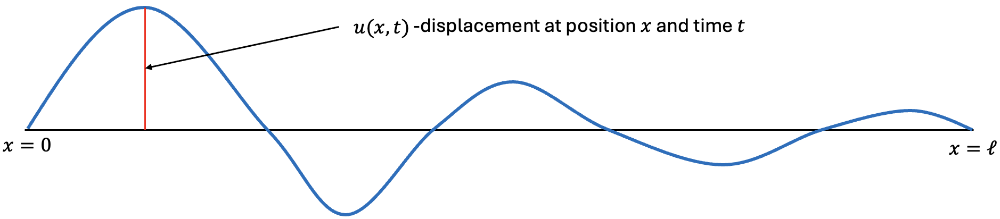
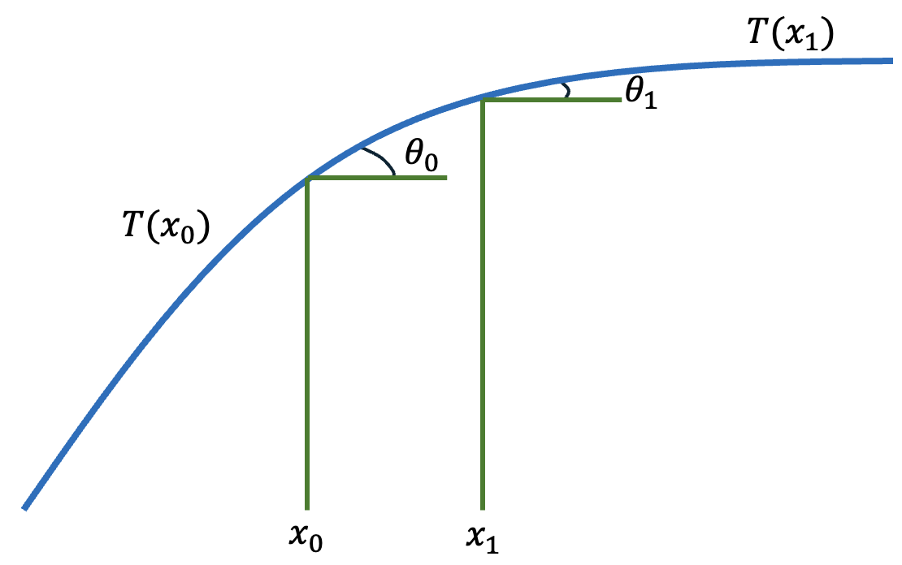
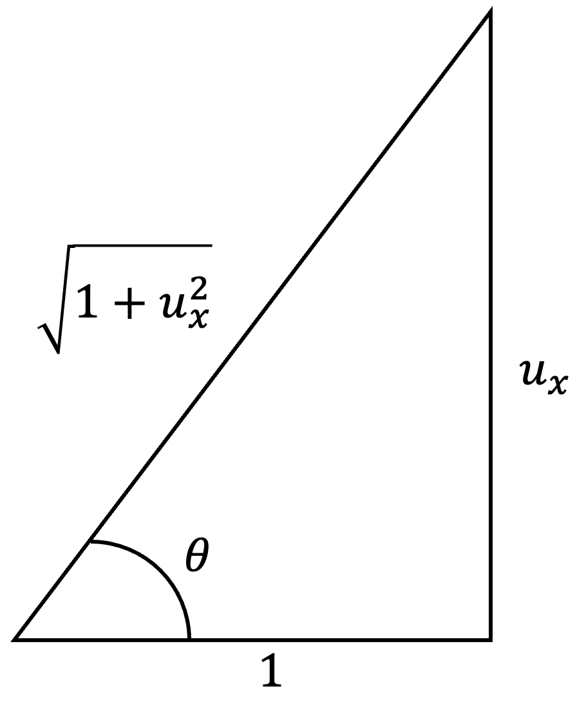

If your physics knowledge comes mostly from brilliant communicators like Neil deGrasse Tyson or Brian Cox, you aren't alone. However, while pop science is fantastic for sparking curiosity, it rarely gives you the tools to look under the hood yourself. To really understand the universe—and eventually, to teach machine learning models how to simulate it—we have to speak its native language: Partial Differential Equations (PDEs). I know that term can be a massive mental barrier. If you've had bad experiences with math in the past, PDEs can sound incredibly intimidating. My goal in this first post is to completely demystify them. If you have a basic grasp of limits and derivatives, you have everything you need to follow along.

## Partial Derivatives

Let $f(x,y)$ be a function of two variables. We can take a derivative with respect to one variable, while the other is held constant. These are the *partial derivatives*, or *partials*, of $f$. 

$$
\frac{\partial f}{\partial x} = \lim_{h\rightarrow 0}\frac{f(x+h,y) - f(x,y)}{h},
$$
$$
\frac{\partial f}{\partial y} = \lim_{k\rightarrow 0}\frac{f(x,y+k)-f(x,y)}{k}.
$$

In practical terms, if $f(x,y)$ describes a surface, then $f_x$ measures how the surface
changes as we move in the $x$-direction while keeping $y$ fixed. Similarly, $f_y$ measures
the change in the $y$-direction while $x$ is fixed. 

### Example

Suppose we have the function:

$$f(x,y) = x^2 + 3xy.$$

Differentiating with respect to $x$ and holding $y$ constant gives us:

$$f_x(x,y) = 2x+3y,$$

while differentiating with respect to $y$ and holding $x$ constant gives us:

$$f_y(x,y) = 3x.$$

## Definition of a PDE

A **PDE** is a relationship between an unknown function $u(x,y,\cdots)$ of at least two variables, its partials,
and functions of the independent variables. The **order** of a PDE is the highest derivative appearing. 

More formally, a PDE is an equation of the form:

$$F(x_1,x_2,\cdots, x_n, u, u_{x_1}, u_{x_2},\cdots, u_{x_1 x_2},\cdots) = 0,$$

where $x_1,\cdots x_n$ are the *independent variables*, $u$ is the unknown function (also called the
*dependent variable*) that depends on these variables, and $u_{x_i}, u_{x_{i} x_{j}}$ represent
the *partial derivatives* of $u$ with respect to the independent variables. Note that we do not
stop at order two in the general case. Higher-order PDEs occur as well, 
although first- and second-order equations are the most common examples in an introductory
course.  

### Examples 

1. **Transport Equation**

$$\frac{\partial u}{\partial t} + c\frac{\partial u}{\partial x} = 0,\qquad \text{Order = 1}$$

2. **Laplace's Equation**

$$\frac{\partial^2 u}{\partial x^2} + \frac{\partial^2 u}{\partial y^2} = 0,\qquad \text{Order = 2}$$

3. **Heat Equation**

$$\frac{\partial u}{\partial t} = \kappa\frac{\partial^2 u}{\partial x^2},\qquad \text{Order = 2}$$

Note that for the heat equation, although it contains only a first derivative with respect
to time, it is second order because $u_{xx}$ is a second derivative.

## What Does it Mean to Solve a PDE? 

For now, we will use the "classical" notion of a solution. A sufficiently differentiable
function $u$ solves a PDE on a domain $D$ if substituting $u$ and its partial derivatives 
into the equation makes the equation true at every point in $D$. If the problem also includes
initial or boundary conditions, then $u$ must satisfy those conditions as well. 

### Example 

$$u(x,t) = e^{-t}\sin(2x)$$

Does $u$ solve $4u_t = u_{xx}$? Let's find out!

$$u_t = -e^{-t}\sin(2x)\quad\Rightarrow\quad 4u_t = -4e^{-t}\sin(2x),$$

$$u_x = 2e^{-t}\cos(2x)\quad\Rightarrow\quad u_{xx} = -4e^{-t}\sin(2x).$$

So, we can verify that this particular $u$ solves the given PDE! (If you look closely,
you can verify that this is a variation of the heat equation with diffusivity $\kappa = \frac{1}{4}$). Well, that wasn't so bad...
is this really all physicists do? Well, as it turns out, *checking* if a given function 
is a solution to a PDE is much more straightforward than actually *finding* solutions. 
And "the solution" is perhaps an improper phrase to use. A PDE by itself often has an infinite 
number of solutions. Initial and boundary conditions help determine which solution
describes the particular situation we care about. Even after initial and boundary conditions
are supplied, many PDE problems do not have a useful closed-form solution. In those cases,
numerical methods allow us to approximate the solution on a computer. 

Everything I just said will make more sense in future blog posts, but it should be well-established
that the process of finding solutions to PDEs is not as straightforward as finding solutions 
to algebraic equations you may have dealt with in the past. This is not to say it is more difficult,
but it certainly requires a different approach. 

Some unanswered questions go deeper than finding a convenient closed-form formula. In certain cases, fundamental questions about the existence and regularity of solutions remain unresolved. A famous example is the three-dimensional incompressible Navier–Stokes system. The associated Millennium Prize Problem asks, roughly speaking, whether smooth solutions arising from suitable smooth initial data always remain smooth for all time, or whether they can develop singularities [@fefferman2006navierstokes]. As of July 2026, the Clay Mathematics Institute still lists the problem as unsolved, with 1 million US dollars allocated to its solution [@claymillennium].

## Optional Deep Dive: Derivation of a 1D Wave Equation 

To cap off this first post, I would like to do a derivation relating to physics so that you can see 
how valuable PDEs are for modelling the world around us. To fully follow along with this derivation,
I recommend the reader also have some knowledge of antiderivatives and integration as well as Newton's 
second law. 

Suppose an elastic string of length $\ell$ has both ends tied down and is subject to transverse waves.
Let $u(x,t)$ denote the vertical displacement of the string at horizontal position $x$ and time $t$.
Assume that the string has uniform linear mass density $\rho$, measured in kg/m, and that its 
motion is purely transverse. Because the endpoints are fixed, we have:

$$u(0,t) = u(\ell, t) = 0.$$

Further, we assume that its slope is small in
magnitude ($|u_x|\ll 1$), and damping and external forces are neglected. 

Now, we can zoom in and pick two distinct points on the string $x_0$ and $x_1$. At the endpoints
of this segment, the tangent to the string makes angles $\theta_0$ and $\theta_1$
with the horizontal. The corresponding tension magnitudes are $T(x_0)$ and $T(x_1)$ respectively:

{width=50%}

Now, we have to balance the forces. Since there is no horizontal acceleration (the string only vibrates)
the forces will add up to zero. 

$$T(x_1)\cos(\theta_1) - T(x_0)\cos(\theta_0) = 0.$$

However, there *is* a vertical acceleration. So, we can obtain the total vertical force using 
Newton's second law $F = ma$, where the vertical acceleration of the string is $u_{tt}$. 
Between points $x_0$ and $x_1$, we can take the integral of mass density times 
acceleration to give us the net vertical force:

$$T(x_1)\sin(\theta_1) - T(x_0)\sin(\theta_0) = \int_{x_0}^{x_1}\rho u_{tt}dx.$$

{width=50%}

Now, using the right triangle that is formed by the angle and vertical change (demonstrated above) we 
can observe that:

$$\sin(\theta) = \frac{u_x}{\sqrt{1+u_x^2}},\qquad \cos(\theta) = \frac{1}{\sqrt{1+u_x^2}}.$$

Under the small-slope assumption, $|u_x| \ll 1$, we approximate the $\sin$ and $\cos$
values as:

$$\sin(\theta) \approx u_x,\qquad \cos(\theta) \approx 1.$$

So, under the small-slope approximation, the horizontal force balance becomes:

$$T(x_1) -T(x_0)\approx 0.$$

Therefore, to leading order, we treat the tension magnitude 
as constant along the string and denote it by $T$. This is handy, because we can now substitute this into our vertical force balance equation:

$$T(u_x(x_1,t) - u_x(x_0,t)) = \rho\int_{x_0}^{x_1} u_{tt}(x,t)dx.$$

By the Fundamental Theorem of Calculus, we know that:

$$u_x(x_1,t) - u_x(x_0,t) = \int_{x_0}^{x_1}u_{xx}(x,t)dx.$$

Thus, we obtain:

$$T\int_{x_0}^{x_1}u_{xx}(x,t)dx = \rho\int_{x_0}^{x_1}u_{tt}(x,t)dx.$$

Because this equality holds for every interval $[x_0,x_1]$, and because the integrands
are continuous, the integrands must be equal:

$$Tu_{xx} = \rho u_{tt}.$$

And, if we define $c:= \sqrt{\frac{T}{\rho}}$ (where $c$ denotes the speed at which waves propagate along the string), we obtain the one-dimensional wave equation in its 
familiar form:

$$u_{tt} = c^2u_{xx}.$$

Voilà! Of course, this is just a 1D string and physics can get quite a bit more complicated than this,
but the premise of modelling physical phenomena with the help of PDEs is a consistent theme
throughout many areas of physics. 

*Note*: This is just a reminder that we did not *solve* the 1D wave equation, we simply
derived the PDE that defines the dynamics. As it turns out, solving this PDE analytically
requires a bit more mathematics, which will potentially be discussed in future blog posts.

## Takeaway

A PDE is not merely an equation containing unusual derivative symbols. It is a local rule describing how a quantity changes with respect to multiple independent variables—often space and time. Together with appropriate initial and/or boundary conditions, that rule can become a mathematical model of a physical system.

We have not yet solved the wave equation—or any other PDE in a systematic way. That is where the next parts of this series will lead: first toward analytical methods, then numerical approximation, and eventually toward the ways scientific machine learning can learn from or work alongside these equations. 

*All figures are my own.*

## References 

::: {#refs}
:::
